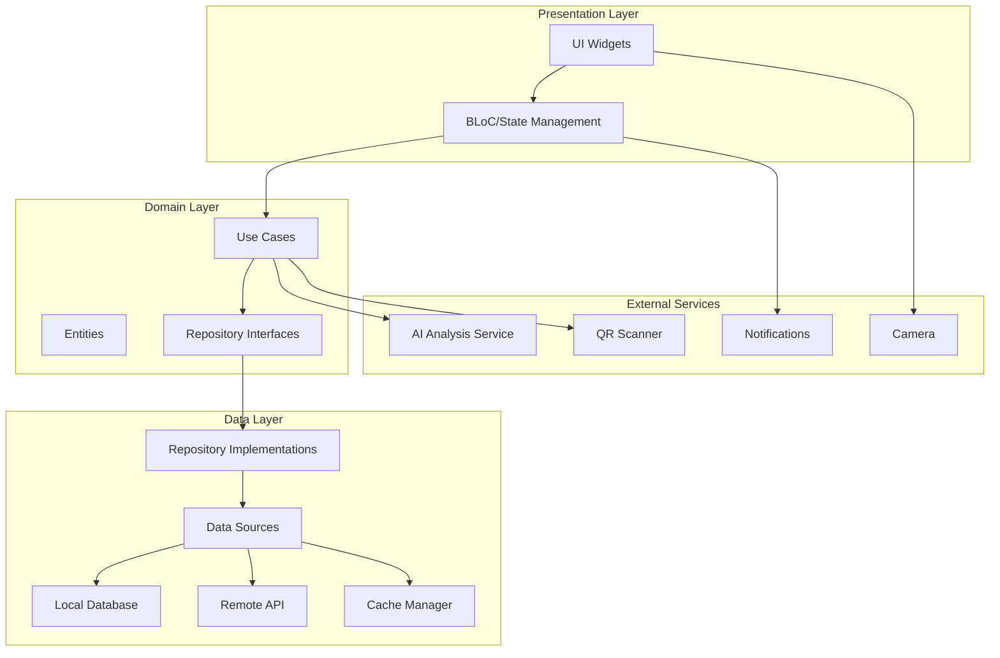

# Design Document - Calorie Tracker App

## Overview

La aplicación de seguimiento de calorías es una solución multiplataforma desarrollada en Flutter que permite a los usuarios monitorear su ingesta nutricional mediante múltiples métodos de entrada: búsqueda manual, escaneo de códigos QR y análisis de imágenes con IA. La arquitectura sigue el patrón Clean Architecture con separación clara de capas, permitiendo escalabilidad, mantenibilidad y testing efectivo.

La aplicación está diseñada para funcionar tanto en modo online como offline, con sincronización automática de datos. La interfaz se adapta responsivamente a diferentes tamaños de pantalla (móvil y escritorio) manteniendo una experiencia de usuario consistente.

## Architecture

### High-Level Architecture



### Layer Responsibilities

**Presentation Layer:**
- Widgets de Flutter para UI responsiva
- BLoC para gestión de estado
- Adaptación de layout según plataforma (móvil/desktop)
- Manejo de navegación

**Domain Layer:**
- Lógica de negocio pura
- Entidades del dominio
- Casos de uso independientes de framework
- Interfaces de repositorios

**Data Layer:**
- Implementación de repositorios
- Gestión de fuentes de datos (local/remoto)
- Caché y sincronización
- Mapeo de modelos

## Components and Interfaces

### Core Components

#### 1. User Profile Management

**Componente:** `UserProfileManager`

**Responsabilidades:**
- Gestión del perfil nutricional del usuario
- Cálculo de objetivos calóricos (Harris-Benedict)
- Actualización de parámetros físicos
- Persistencia de datos de perfil

**Interfaces:**
```dart
abstract class UserProfileRepository {
  Future<UserProfile> getUserProfile();
  Future<void> saveUserProfile(UserProfile profile);
  Future<void> updateUserProfile(UserProfile profile);
  Future<CalorieGoal> calculateCalorieGoal(UserProfile profile, GoalType goalType);
}

class UserProfile {
  String id;
  String name;
  int age;
  double weight;
  double height;
  Gender gender;
  ActivityLevel activityLevel;
  GoalType goalType;
  DateTime createdAt;
  DateTime updatedAt;
}

enum GoalType { loseWeight, maintainWeight, gainMuscle }
enum ActivityLevel { sedentary, light, moderate, active, veryActive }
```

#### 2. Food Database & Search

**Componente:** `FoodDatabaseService`

**Responsabilidades:**
- Búsqueda de alimentos con autocompletado
- Gestión de base de datos nutricional local
- Sincronización con base de datos remota
- Caché de búsquedas frecuentes

**Interfaces:**
```dart
abstract class FoodRepository {
  Future<List<Food>> searchFoods(String query);
  Future<Food?> getFoodById(String id);
  Future<Food?> getFoodByBarcode(String barcode);
  Future<void> syncFoodDatabase();
  Stream<List<Food>> searchFoodsStream(String query);
}

class Food {
  String id;
  String name;
  String brand;
  double caloriesPer100g;
  Macronutrients macrosPer100g;
  String barcode;
  List<ServingSize> servingSizes;
  DateTime lastUpdated;
}

class Macronutrients {
  double protein;
  double carbohydrates;
  double fats;
  double fiber;
}

class ServingSize {
  String name;
  double grams;
  String unit;
}
```

#### 3. Food Logging System

**Componente:** `FoodLogger`

**Responsabilidades:**
- Registro de alimentos consumidos
- Cálculo de valores nutricionales por porción
- Gestión de comidas diarias
- Historial de consumo

**Interfaces:**
```dart
abstract class FoodLogRepository {
  Future<void> logFood(FoodEntry entry);
  Future<void> updateFoodEntry(FoodEntry entry);
  Future<void> deleteFoodEntry(String entryId);
  Future<List<FoodEntry>> getFoodEntriesByDate(DateTime date);
  Future<DailySummary> getDailySummary(DateTime date);
  Stream<DailySummary> watchDailySummary(DateTime date);
}

class FoodEntry {
  String id;
  String userId;
  Food food;
  double quantity;
  String unit;
  NutritionalValues calculatedValues;
  DateTime timestamp;
  MealType mealType;
  EntrySource source;
}

enum MealType { breakfast, lunch, dinner, snack }
enum EntrySource { manual, qrScan, aiAnalysis }

class DailySummary {
  DateTime date;
  double totalCalories;
  Macronutrients totalMacros;
  List<FoodEntry> entries;
  CalorieGoal goal;
  double remainingCalories;
}
```

#### 4. QR Code Scanner & Open Food Facts Integration

**Componente:** `QRScannerService` + `OpenFoodFactsService`

**Responsabilidades:**
- Acceso y gestión de cámara
- Detección y decodificación de códigos QR/barras en tiempo real
- Integración con Open Food Facts API para búsqueda de productos
- Búsqueda de producto por código de barras
- Manejo de errores de escaneo

**Interfaces:**
```dart
abstract class QRScannerService {
  Future<void> initializeCamera();
  Stream<QRScanResult> scanStream();
  Future<void> dispose();
  Future<bool> hasPermission();
  Future<void> requestPermission();
}

class QRScanResult {
  String code;
  QRCodeType type;
  DateTime scannedAt;
}

enum QRCodeType { ean13, ean8, upca, upce, qrCode, unknown }

abstract class OpenFoodFactsService {
  Future<ProductInfo?> getProductByBarcode(String barcode);
  Future<List<ProductInfo>> searchProducts(String query);
  Future<bool> isServiceAvailable();
}

class ProductInfo {
  String barcode;
  String productName;
  String? brand;
  String? imageUrl;
  NutritionalValues nutritionalValues;
  String? servingSize;
  double? servingSizeGrams;
  OpenFoodFactsQuality quality;
}

class OpenFoodFactsQuality {
  bool hasNutritionalInfo;
  bool hasImage;
  int completenessScore; // 0-100
}
```

#### 5. AI Image Analysis

**Componente:** `AIFoodAnalysisService`

**Responsabilidades:**
- Captura y procesamiento de imágenes
- Integración con servicio de IA (Google Vision API / Custom Model)
- Identificación de alimentos en imágenes
- Estimación de porciones

**Interfaces:**
```dart
abstract class AIAnalysisService {
  Future<AIAnalysisResult> analyzeImage(ImageFile image);
  Future<bool> isServiceAvailable();
  Future<void> cancelAnalysis();
}

class AIAnalysisResult {
  List<DetectedFood> detectedFoods;
  double confidence;
  DateTime analyzedAt;
  String? errorMessage;
}

class DetectedFood {
  String foodName;
  double confidence;
  double estimatedGrams;
  Food? matchedFood;
  BoundingBox? location;
}

class ImageFile {
  String path;
  Uint8List bytes;
  int width;
  int height;
}
```

#### 6. Dashboard & Analytics

**Componente:** `DashboardService`

**Responsabilidades:**
- Cálculo de métricas diarias y periódicas
- Generación de gráficos y visualizaciones
- Análisis de tendencias
- Generación de insights

**Interfaces:**
```dart
abstract class AnalyticsRepository {
  Future<WeeklySummary> getWeeklySummary(DateTime startDate);
  Future<MonthlySummary> getMonthlySummary(int year, int month);
  Future<ProgressStats> getProgressStats(DateRange range);
  Future<List<Insight>> generateInsights(DateRange range);
}

class WeeklySummary {
  DateRange dateRange;
  double averageCalories;
  Macronutrients averageMacros;
  int daysMetGoal;
  List<DailySummary> dailySummaries;
  Map<MealType, double> caloriesByMeal;
}

class ProgressStats {
  double averageCalories;
  double calorieVariance;
  List<WeightEntry> weightHistory;
  double weightChange;
  int streakDays;
  double goalAdherence;
}

class Insight {
  InsightType type;
  String message;
  String recommendation;
  double relevanceScore;
}

enum InsightType { 
  caloriePattern, 
  macroBalance, 
  mealTiming, 
  goalProgress,
  consistency 
}
```

#### 7. Offline Sync Manager

**Componente:** `SyncManager`

**Responsabilidades:**
- Detección de estado de conectividad
- Cola de operaciones pendientes
- Sincronización bidireccional
- Resolución de conflictos

**Interfaces:**
```dart
abstract class SyncService {
  Stream<SyncStatus> get syncStatusStream;
  Future<void> syncNow();
  Future<void> queueOperation(SyncOperation operation);
  Future<List<SyncOperation>> getPendingOperations();
  Future<void> resolveSyncConflict(SyncConflict conflict, ConflictResolution resolution);
}

class SyncOperation {
  String id;
  OperationType type;
  Map<String, dynamic> data;
  DateTime createdAt;
  int retryCount;
}

enum OperationType {
  createFoodEntry,
  updateFoodEntry,
  deleteFoodEntry,
  updateProfile,
  updateGoal
}

class SyncStatus {
  bool isOnline;
  bool isSyncing;
  int pendingOperations;
  DateTime? lastSyncTime;
  String? errorMessage;
}
```

#### 8. Notification Manager

**Componente:** `NotificationService`

**Responsabilidades:**
- Programación de notificaciones locales
- Gestión de recordatorios de comidas
- Alertas de objetivos
- Configuración de preferencias

**Interfaces:**
```dart
abstract class NotificationService {
  Future<void> scheduleReminder(MealReminder reminder);
  Future<void> cancelReminder(String reminderId);
  Future<void> sendGoalAlert(GoalAlert alert);
  Future<void> sendMotivationalNotification();
  Future<bool> hasPermission();
  Future<void> requestPermission();
}

class MealReminder {
  String id;
  MealType mealType;
  TimeOfDay time;
  List<int> daysOfWeek;
  bool enabled;
}

class GoalAlert {
  AlertType type;
  String message;
  double progress;
}

enum AlertType { nearGoal, goalExceeded, goalMet, inactivity }
```

## Data Models

### Local Database Schema (SQLite/Hive)

**Tables:**

1. **user_profiles**
   - id (PRIMARY KEY)
   - name
   - age
   - weight
   - height
   - gender
   - activity_level
   - goal_type
   - created_at
   - updated_at

2. **calorie_goals**
   - id (PRIMARY KEY)
   - user_id (FOREIGN KEY)
   - daily_calories
   - protein_grams
   - carbs_grams
   - fats_grams
   - effective_date
   - created_at

3. **foods**
   - id (PRIMARY KEY)
   - name
   - brand
   - calories_per_100g
   - protein_per_100g
   - carbs_per_100g
   - fats_per_100g
   - fiber_per_100g
   - barcode
   - last_updated
   - is_custom

4. **food_entries**
   - id (PRIMARY KEY)
   - user_id (FOREIGN KEY)
   - food_id (FOREIGN KEY)
   - quantity
   - unit
   - calories
   - protein
   - carbs
   - fats
   - timestamp
   - meal_type
   - source
   - synced

5. **sync_queue**
   - id (PRIMARY KEY)
   - operation_type
   - entity_type
   - entity_id
   - data (JSON)
   - created_at
   - retry_count
   - last_error

6. **weight_history**
   - id (PRIMARY KEY)
   - user_id (FOREIGN KEY)
   - weight
   - recorded_at

### Remote API Data Models

**Endpoints:**

```
POST   /api/v1/auth/register
POST   /api/v1/auth/login
GET    /api/v1/users/profile
PUT    /api/v1/users/profile
GET    /api/v1/foods/search?q={query}
GET    /api/v1/foods/{id}
GET    /api/v1/foods/barcode/{code}
POST   /api/v1/food-entries
PUT    /api/v1/food-entries/{id}
DELETE /api/v1/food-entries/{id}
GET    /api/v1/food-entries?date={date}
POST   /api/v1/ai/analyze-image
GET    /api/v1/analytics/summary?start={date}&end={date}
POST   /api/v1/sync/pull
POST   /api/v1/sync/push
```

## Error Handling

### Error Categories

1. **Network Errors**
   - No internet connection → Queue operation for sync
   - Timeout → Retry with exponential backoff
   - Server error → Show user-friendly message, log for debugging

2. **Camera/Permission Errors**
   - Permission denied → Show explanation and settings link
   - Camera unavailable → Fallback to manual entry
   - QR scan failure → Retry or manual barcode entry

3. **AI Analysis Errors**
   - Service unavailable → Fallback to manual entry
   - Low confidence results → Show results with warning
   - Image quality issues → Prompt user to retake photo

4. **Data Validation Errors**
   - Invalid input → Show inline validation messages
   - Calculation errors → Use safe defaults, log error
   - Sync conflicts → Present conflict resolution UI

### Error Handling Strategy

```dart
class AppError {
  ErrorType type;
  String message;
  String? technicalDetails;
  ErrorSeverity severity;
  DateTime occurredAt;
  
  bool get isRecoverable => severity != ErrorSeverity.critical;
}

enum ErrorType {
  network,
  permission,
  validation,
  service,
  sync,
  unknown
}

enum ErrorSeverity {
  info,
  warning,
  error,
  critical
}

abstract class ErrorHandler {
  void handleError(AppError error);
  void logError(AppError error);
  String getUserMessage(AppError error);
  Future<void> reportError(AppError error);
}
```

## Testing Strategy

### Unit Testing

**Coverage Areas:**
- Cálculos de calorías y macronutrientes
- Lógica de negocio en casos de uso
- Validaciones de entrada
- Conversiones de unidades
- Fórmulas nutricionales (Harris-Benedict, etc.)

**Tools:** flutter_test, mockito

### Integration Testing

**Coverage Areas:**
- Flujo completo de registro de alimentos
- Sincronización offline/online
- Integración con servicios externos (AI, QR)
- Persistencia de datos local

**Tools:** integration_test package

### Widget Testing

**Coverage Areas:**
- Renderizado de componentes UI
- Interacciones de usuario
- Navegación entre pantallas
- Adaptación responsiva

**Tools:** flutter_test, golden_toolkit

### E2E Testing

**Scenarios:**
- Onboarding completo de nuevo usuario
- Registro de alimento por búsqueda manual
- Escaneo QR y registro
- Captura de foto y análisis IA
- Visualización de dashboard y estadísticas

**Tools:** integration_test, patrol

## Platform-Specific Considerations

### Android

- Permisos: CAMERA, INTERNET, NOTIFICATIONS
- Tamaño mínimo de SDK: 21 (Android 5.0)
- Optimización de batería para sincronización en background
- Soporte para Material Design 3

### Desktop (Windows/Linux/macOS)

- Layout adaptado para pantallas grandes
- Navegación con teclado y atajos
- Ventanas redimensionables
- Menús nativos de la plataforma
- Sincronización en background sin restricciones

### Responsive Design Breakpoints

```dart
class ScreenBreakpoints {
  static const double mobile = 600;
  static const double tablet = 900;
  static const double desktop = 1200;
}

// Layout adapta automáticamente:
// < 600px: Single column, bottom navigation
// 600-900px: Two columns, side navigation
// > 900px: Multi-column dashboard, persistent navigation
```

## Security Considerations

1. **Data Encryption**
   - Datos sensibles encriptados en local (flutter_secure_storage)
   - Comunicación HTTPS con certificado pinning
   - Tokens JWT para autenticación

2. **Privacy**
   - Datos de usuario almacenados localmente por defecto
   - Sincronización opcional con servidor
   - No compartir datos con terceros sin consentimiento

3. **API Security**
   - Rate limiting en endpoints
   - Validación de entrada en servidor
   - Autenticación requerida para operaciones sensibles

## Performance Optimization

1. **Database**
   - Índices en campos de búsqueda frecuente
   - Paginación de resultados
   - Caché de consultas comunes

2. **UI**
   - Lazy loading de listas largas
   - Image caching para fotos de alimentos
   - Debouncing en búsqueda con autocompletado

3. **Network**
   - Compresión de imágenes antes de enviar a IA
   - Batch sync de operaciones pendientes
   - Caché de respuestas API

## Third-Party Services & Packages

### Required Flutter Packages

```yaml
dependencies:
  # State Management
  flutter_bloc: ^8.1.3
  
  # Local Storage
  hive: ^2.2.3
  hive_flutter: ^1.1.0
  sqflite: ^2.3.0
  flutter_secure_storage: ^9.0.0
  
  # Network
  dio: ^5.4.0
  connectivity_plus: ^5.0.2
  openfoodfacts: ^3.0.0  # Open Food Facts API client
  
  # Camera & QR
  camera: ^0.10.5
  mobile_scanner: ^3.5.5
  image_picker: ^1.0.7
  
  # Charts & Visualization
  fl_chart: ^0.66.0
  
  # Notifications
  flutter_local_notifications: ^16.3.0
  
  # UI
  google_fonts: ^6.1.0
  flutter_svg: ^2.0.9
  
  # Utils
  intl: ^0.18.1
  equatable: ^2.0.5
  dartz: ^0.10.1
```

### External Services

1. **AI Image Analysis**
   - Option 1: Google Cloud Vision API
   - Option 2: Custom TensorFlow Lite model
   - Option 3: Clarifai Food Recognition API

2. **Food Database & Barcode Scanning**
   - **Primary:** Open Food Facts API (https://world.openfoodfacts.org)
     - Free and open database with 2M+ products
     - Barcode lookup endpoint: GET /api/v2/product/{barcode}
     - Search endpoint: GET /cgi/search.pl
     - No API key required
     - Community-driven nutritional data
   - **Fallback:** USDA FoodData Central API for generic foods
   - **Local:** Custom database with common foods for offline mode

3. **Backend (Optional)**
   - Firebase (Auth, Firestore, Storage)
   - Custom REST API (Node.js/Python)
